タスク終了通知アプリ  
 
作成：2022年3月17日(初版)

# 目的
- 稼働させ続けたいある特定のタスクが終了した際に、終了したことを知らせることで、即座にタスクの再起動を行うことを可能とする。

# 要件
- タスク監視
  - 一定間隔でタスクが生きているかを確認する
- 通知機能
  - 音で知らせる
    - 音が鳴る時間を指定
    - 音量確認機能
- タスクの自動再起動
  - ON/OFF機能
- 設定を保持する

## できれば（いずれ）
- ログを取る
  - いつタスクが終了したか
  - メモリの使用量
- アプリの自動再起動機能
  - 実行させ続けた場合、どのくらいメモリを使用するか不明だが、消費量が大きくなるようならタスク終了通知後に再起動する機能を追加する。

# 開発環境
- Windows10
- Visual Studio 2019

# シーケンス図

# 詳細
## 監視機能
- `EnumWindows`でタスクを監視する
  - 監視対象のウィンドウタイトルを用いる。
  - 10秒間隔で確認。
  - 要消費メモリの確認。結果によってはもっと間隔を詰められるかもしれない。
## 通知機能
- タスク終了イベントを受けて、音を鳴らす
  - 1秒間隔で鳴らす
  - 1秒～30秒の間で設定する。
  - 参考：[システムサウンドを再生する](https://dobon.net/vb/dotnet/programing/playsystemsound.html)
## 設定機能
- 設定はiniファイルで保持する。

# GUI
- 起動画面/実行中画面
  - 「監視開始」ボタンを押すと、右の実行中画面に切り替わる
  - 「設定」ボタンを押すと、設定画面に切り替わる

- タスク終了通知画面
  - 監視対象のタスクが終了するとこの画面が表示される
  - 中央にはタスク終了を感知した時刻が表示される
  - 停止ボタンを押すと本アプリが終了する
  - 音がなっている場合は音を止めた上で本アプリは終了する

- 設定画面
  - 通知音はテキストボックスで入力する。0~30の間
  - 「音量テスト」ボタンはトグルボタン。押すと音が鳴り、再度押すと音の再生が止まる。
  - 「自動再起動」ボタンはトグルボタン。押すとOFFに、再度押すとONになる
  - 「パス」は自動再起動で実行する実行ファイルのパス。テキストボックス。自動再起動OFF時にはグレースケールになり、入力できない。

